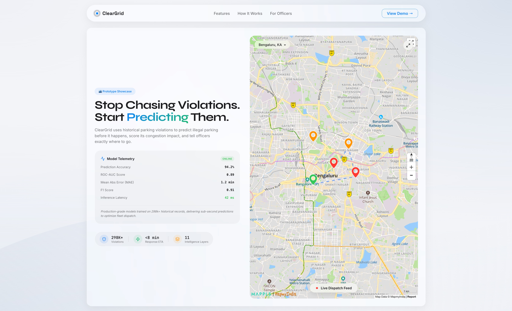
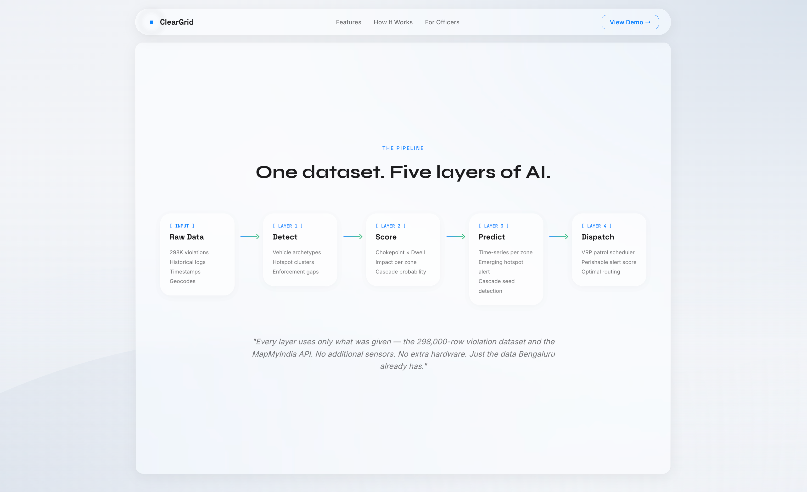

<div align="center">
  

  <h1>ClearGrid</h1>
  <p><strong>Stop Chasing Violations. Start Predicting Them.</strong></p>
  <p><i>An AI-powered operating system for intelligent parking enforcement. Built for the Flipkart Gridlock Hackathon.</i></p>

  ---
</div>

## 🚀 Overview

Most systems show you where violations happened yesterday. **ClearGrid** tells you where they'll happen in the next two hours — and sends the right officer there before the car even parks. 

Powered by a massive dataset of 298,000 historical violations and the MapmyIndia API, ClearGrid acts as a complete pipeline that **Detects, Scores, Predicts, and Dispatches**. It replaces manual patrolling with data-driven predictive deployment.

<div align="center">
  
  <br/><br/>
  
</div>

## ✨ Key Features & Intelligence Layers

ClearGrid isn't just a heatmap. It's a suite of 5 intelligence layers designed to optimize city resources and eliminate enforcement deserts.

### 📍 1. Hotspot Intelligence
Real-time visualization of violation density aggregated across H3 hexagonal cells. Instantly see where the highest concentrations of illegal parking are occurring.


### 🚗 2. Optimal Patrol Routing
Generates highly efficient driving routes for enforcement vehicles. We cluster live violation hotspots using KMeans and snap the waypoints to the actual road network using the Open Source Routing Machine (OSRM) driving API.


### ⚠️ 3. Chokepoint Scoring
Scores every hotspot against the road network topology using Edge Betweenness Centrality via OSMnx. A junction with 5 bypass routes is less dangerous than a single-corridor road.


### ⏱️ 4. Dwell Time Analytics
Identifies zones where quick drop-offs turn into chronic congestion by aggregating historical dwell times.


### 📈 5. Anomaly Detection (CUSUM)
A CUSUM control chart running against the 298k row dataset flags H3 cells where the cumulative sum of violations deviates significantly from the historical 8-12 week baseline.


### 🌊 6. Cascade Prediction
Sliding-window seed/follower detection. Identifying which highly-congested cells historically act as triggers for adjacent cell congestion.


## 🛠️ System Architecture


<br/>
- **Backend:** Python, FastAPI, DuckDB (for fast analytical querying on 300k+ rows)
- **Geospatial & ML:** H3 (Hexagonal Hierarchical Spatial Index), scikit-learn (KMeans), OSMnx (Network topology), OSRM (Routing geometry)
- **Frontend:** React, Vite, GSAP (Animations), Lucide Icons
- **Mapping:** MapmyIndia API (mappls-web-maps)

## 👮 Officer Workflow

The platform provides a streamlined experience for enforcement officers in the field, creating a closed-loop feedback system that continuously updates the pipeline's health.


## 💻 Running Locally

To run the ClearGrid stack locally, you need to start both the Python backend and the React frontend.

### 1. Backend (FastAPI + DuckDB)
```bash
cd cleargrid-app
pip install -r requirements.txt
# Start the API server on http://localhost:8000
uvicorn api.main:app --reload
```

### 2. Frontend (React + Vite)
```bash
cd marketing-site
npm install
# Start the dev server
npm run dev
```

## 🎥 Demo
A full demo of the application is available in the repository. Please view `demo_recorded.mov` (note: due to file size, this may be hosted externally or require local playback).

---
<div align="center">
  <i>Built for the Flipkart Gridlock Hackathon</i>
</div>
